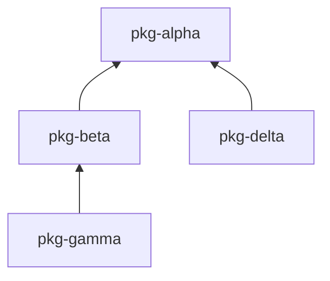

# lazy-wheels

Push-button releases for your [uv](https://github.com/astral-sh/uv) multi-package monorepo.

- Rebuilds only changed packages (and their dependents)
- You own major.minor, CI owns patch
- One command: `lazy-wheels release`

## Installation + Usage

**Requirements:**
- [uv](https://github.com/astral-sh/uv) installed
- A git repository
- A `pyproject.toml` with `[tool.uv.workspace]` members defined

**Install**

Install as a uv tool

```bash
uv tool install lazy-wheels
```

**Initialize**

Run once in your repo:

```bash
lazy-wheels init
```

For mixed-architecture builds, specify per-package runners with `-m`:

```bash
lazy-wheels init -m pkg-alpha ubuntu-latest -m pkg-beta ubuntu-latest macos-14
```

Each `-m` takes a package name followed by one or more runners.

**Release**

Then when you want to release:
```bash
lazy-wheels release
# Specify a release name
lazy-wheels release -r r1
# Force all packages to rebuild
lazy-wheels release --force-all
```

## How It Works

1. **Discover** — Scans `[tool.uv.workspace]` members to find all packages and their dependencies
2. **Detect changes** — Compares each package against its last release tag (`{pkg}/v{version}`)
3. **Propagate dirtiness** — Marks dependents of changed packages as dirty
4. **Fetch unchanged** — Downloads wheels for unchanged packages from previous GitHub releases
5. **Build changed** — Runs `uv build` only on packages that need rebuilding
6. **Tag** — Creates per-package version tags (e.g., `my-pkg/v1.2.3`)
7. **Bump versions** — Increments patch version in each built package's `pyproject.toml`
8. **Publish** — Creates a GitHub Release with all wheels (changed + unchanged)
9. **Push** — Commits version bumps and pushes tags

## Repository Structure

This repo is itself a uv workspace monorepo with dummy packages for testing:

```
lazy-wheels/
├── packages/
│   ├── lazy-wheels/     # The actual CLI tool (published to PyPI)
│   ├── pkg-alpha/       # Dummy: no dependencies
│   ├── pkg-beta/        # Dummy: depends on alpha
│   ├── pkg-delta/       # Dummy: depends on alpha (sibling of beta)
│   └── pkg-gamma/       # Dummy: depends on beta
└── pyproject.toml       # Workspace root
```

### Dependency Graph



This structure tests:
- **Leaf changes** — Changing `pkg-gamma` rebuilds only gamma
- **Root changes** — Changing `pkg-alpha` cascades to alpha, beta, delta, gamma
- **Sibling isolation** — Changing `pkg-delta` doesn't affect gamma (different branch)
- **Middle changes** — Changing `pkg-beta` rebuilds beta and gamma
