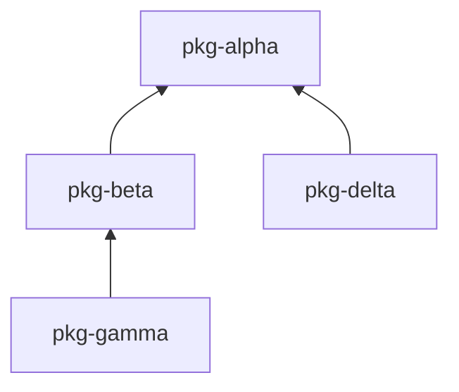

# lazy-wheels

CI release workflow for your multi-package uv monorepo that only rebuilds changed packages.

## Installation + Usage

```bash
uv tool install lazy-wheels
lazy-wheels init
lazy-wheels release
```

## Why lazy-wheels?

Managing versions across multiple packages in a monorepo is painful. lazy-wheels makes it simple: **you own major.minor, CI owns patch**. When you're ready for a breaking change or new feature, bump the major or minor version yourself. For everything else, CI automatically increments patch versions after each release.

Your `main` branch always stays one patch version ahead of the latest release. This means HEAD is always releasable, version numbers are always increasing, and you never have to think about patch versions again. Change detection uses per-package git tags, so only packages with actual changes (or dependencies on changed packages) get rebuilt.

## Documentation

See [packages/lazy-wheels/README.md](packages/lazy-wheels/README.md) for documentation.

## Repository Structure

This repo is itself a uv workspace monorepo with dummy packages for testing:

```
lazy-wheels/
├── packages/
│   ├── lazy-wheels/     # The actual CLI tool (published to PyPI)
│   ├── pkg-alpha/       # Dummy: no dependencies
│   ├── pkg-beta/        # Dummy: depends on alpha
│   ├── pkg-delta/       # Dummy: depends on alpha (sibling of beta)
│   └── pkg-gamma/       # Dummy: depends on beta
└── pyproject.toml       # Workspace root
```

### Dependency Graph



This structure tests:
- **Leaf changes** — Changing `pkg-gamma` rebuilds only gamma
- **Root changes** — Changing `pkg-alpha` cascades to alpha, beta, delta, gamma
- **Sibling isolation** — Changing `pkg-delta` doesn't affect gamma (different branch)
- **Middle changes** — Changing `pkg-beta` rebuilds beta and gamma
