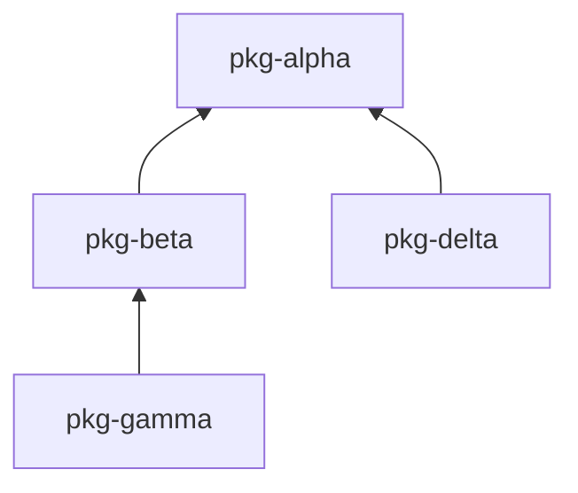

# uv-release-monorepo

Push-button releases for your [uv](https://github.com/astral-sh/uv) multi-package monorepo. It rebuilds only the packages that changed, creates one GitHub release per package, and handles version bumping automatically. You own major.minor; CI owns patch.

## Installation + Usage

You'll need [uv](https://github.com/astral-sh/uv) installed, a git repository with GitHub Actions enabled, and a `pyproject.toml` with `[tool.uv.workspace]` members defined.

Install as a uv tool:

```bash
uv tool install uv-release-monorepo
```

Run once in your repo to generate `.github/workflows/release.yml`:

```bash
uvr init
```

For mixed-architecture builds, specify per-package runners with `-m`. Each `-m` takes a package name followed by one or more runners:

```bash
uvr init -m pkg-alpha ubuntu-latest -m pkg-beta ubuntu-latest macos-14
```

Re-run `uvr init` at any time to update the runner configuration. Existing entries are preserved and only the packages you specify are changed.

When you're ready to release:

```bash
uvr release
```

Pass `--dry-run` to preview the release plan without dispatching anything, or `--force-all` to rebuild every package regardless of detected changes.

## How It Works

`uvr release` runs entirely on your machine first. It scans the workspace, detects which packages changed since their last dev baseline tag, expands the build matrix, and serializes everything into a `ReleasePlan` JSON. That plan is then dispatched to GitHub Actions via `gh workflow run` as a single input. The workflow is a pure executor — it makes no decisions of its own.

On the CI side, a matrix job builds each changed package on its configured runner(s). Once all builds complete, the release job downloads unchanged wheels directly from their existing per-package GitHub releases, publishes a new `{package}/v{version}` release for each changed package, bumps patch versions, commits, tags dev baselines, and pushes.

## Tag Structure

uvr uses two kinds of git tags. A package tag like `my-pkg/v1.2.3` is created for each changed package at release time and doubles as the identifier for its GitHub release. A dev baseline tag like `my-pkg/v1.2.4-dev` is placed on the version-bump commit immediately after a release and serves as the diff base for the next one — only commits after this tag are considered new work.

```
commit A   ← my-pkg/v1.0.0      (released; wheels stored in the my-pkg/v1.0.0 GitHub release)
commit B   ← my-pkg/v1.0.1-dev  (version bumped to 1.0.1; this is the new diff base)
commit C   … normal development …
commit D   ← my-pkg/v1.0.1      (released; wheels stored in the my-pkg/v1.0.1 GitHub release)
commit E   ← my-pkg/v1.0.2-dev  (version bumped to 1.0.2; this is the new diff base)
```

## Installing from GitHub Releases

To install a workspace package and its transitive internal dependencies directly from GitHub releases:

```bash
uvr install my-package
uvr install my-package@1.2.3
```

This resolves the full dependency graph, downloads the appropriate wheels, and installs them with `uv pip install`.

To install a package from another repository, prefix the package name with `org/repo`:

```bash
uvr install acme/my-monorepo/my-package
uvr install acme/my-monorepo/my-package@1.2.3
```

Remote installs download and install the specified package directly. External dependencies are resolved by pip from the wheel metadata.

## Repository Structure

This repo is itself a uv workspace monorepo with dummy packages for testing:

```
uv-release-monorepo/
├── packages/
│   ├── uv-release-monorepo/  # The actual CLI tool (published to PyPI)
│   ├── pkg-alpha/             # Dummy: no dependencies
│   ├── pkg-beta/              # Dummy: depends on alpha
│   ├── pkg-delta/             # Dummy: depends on alpha (sibling of beta)
│   └── pkg-gamma/             # Dummy: depends on beta
└── pyproject.toml             # Workspace root
```

### Dependency Graph


```mermaid
flowchart BT
    alpha[pkg-alpha]
    beta[pkg-beta] --> alpha
    delta[pkg-delta] --> alpha
    gamma[pkg-gamma] --> beta
```

This structure tests:
- **Leaf changes** — Changing `pkg-gamma` rebuilds only gamma
- **Root changes** — Changing `pkg-alpha` cascades to alpha, beta, delta, gamma
- **Sibling isolation** — Changing `pkg-delta` doesn't affect gamma (different branch)
- **Middle changes** — Changing `pkg-beta` rebuilds beta and gamma
