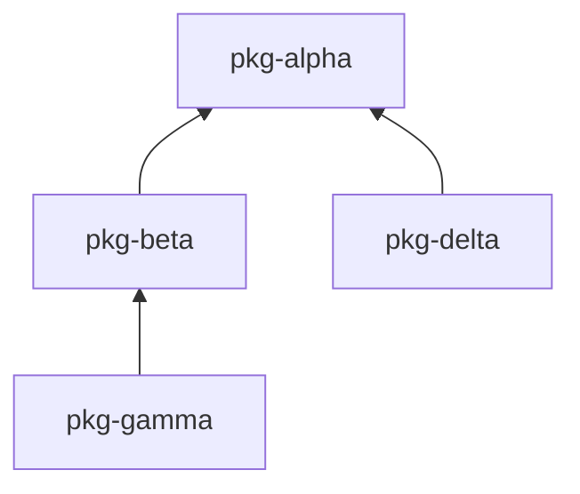

# uv-release-monorepo

Push-button releases for [uv](https://github.com/astral-sh/uv) monorepos. Rebuilds only what changed, creates one GitHub release per package, handles version bumping. You own major.minor; CI owns patch.

## Quick Start

```bash
# Install as a uv tool
uv tool install uv-release-monorepo
# Or via pip
# pip install uv-release-monorepo
# Or as uv dev dependency
# uv add --dev uv-release-monorepo
uvr init
uvr release
```

## What it does

`uvr release` scans your workspace, diffs each package against its last release, walks the dependency graph, builds a plan, and dispatches it to GitHub Actions. Seven jobs run in sequence:

```
pre-build -> build -> post-build -> pre-release -> publish -> finalize -> post-release
```

Hook jobs (pre-build, post-build, pre-release, post-release) are no-ops by default and auto-skipped. Edit `release.yml` directly to add your CI steps — tests, linting, PyPI publish, notifications.

## Key commands

```bash
uvr init                    # generate release.yml
uvr validate                # check release.yml against the model
uvr release                 # detect changes, show plan, dispatch
uvr release --rebuild-all   # rebuild everything
uvr release --skip-to post-release --reuse-release  # re-run a specific job
uvr runners my-pkg --add macos-14   # add a build runner
uvr status                  # show current config
uvr install my-pkg          # install from GitHub releases
```

## Documentation

- **[User Guide](../../docs/user-guide/README.md)** — task-oriented: how to set up, release, customize hooks, publish to PyPI, skip/reuse, filter packages
- **[Under the Hood](../../docs/under-the-hood/README.md)** — implementation details: change detection, dependency pinning, build matrix, workflow model, CI execution

## Repository Structure

This repo is itself a uv workspace monorepo with dummy packages for testing:

```
uv-release-monorepo/
├── packages/
│   ├── uv-release-monorepo/  # The actual CLI tool (published to PyPI)
│   ├── pkg-alpha/             # Dummy: no dependencies
│   ├── pkg-beta/              # Dummy: depends on alpha
│   ├── pkg-delta/             # Dummy: depends on alpha (sibling of beta)
│   └── pkg-gamma/             # Dummy: depends on beta
└── pyproject.toml             # Workspace root
```

### Dependency Graph


```mermaid
flowchart BT
    alpha[pkg-alpha]
    beta[pkg-beta] --> alpha
    delta[pkg-delta] --> alpha
    gamma[pkg-gamma] --> beta
```

This structure tests:
- **Leaf changes** — Changing `pkg-gamma` rebuilds only gamma
- **Root changes** — Changing `pkg-alpha` cascades to alpha, beta, delta, gamma
- **Sibling isolation** — Changing `pkg-delta` doesn't affect gamma (different branch)
- **Middle changes** — Changing `pkg-beta` rebuilds beta and gamma
